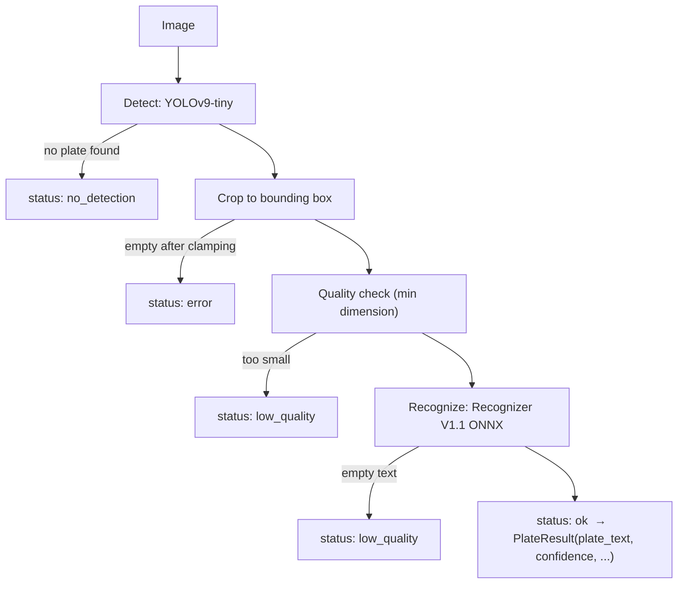
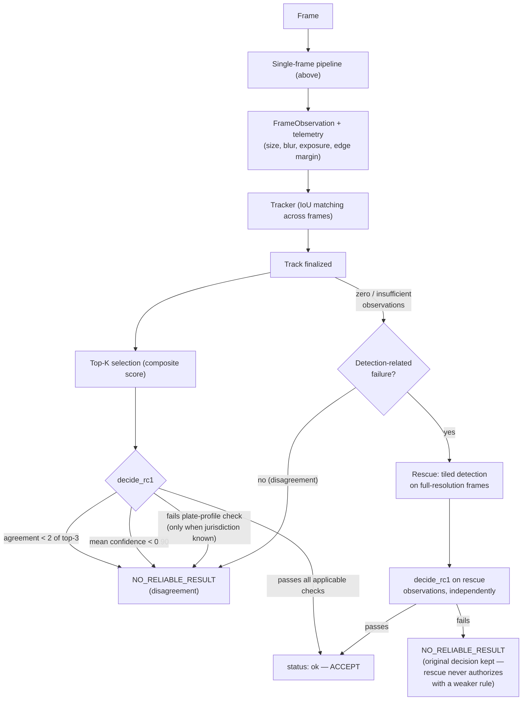

# Architecture

Two entry points, sharing the same single-frame pipeline underneath:
`AlprPipeline` (one image in, one result out) and `ALPRSystem` /
`week9_mp4_runner.py` (a video or frame stream in, one result per
vehicle encounter out — the tracking, fusion, and reliability layer
described below).

## Single-frame pipeline (`pipeline/alpr_pipeline.py`)

The image entry point. Every stage can end the pipeline early with a
specific status.

## Video pipeline and reliability layer (`ALPRSystem`, RC1)

The streaming/video entry point. Each frame goes through the
single-frame pipeline above; results are tracked across frames, pooled,
and passed through the RC1 decision rule before a final answer is
produced per vehicle.

## Key design points

- **Rescue only ever addresses detection-related failure** (the plate
  was never found, or too few usable observations) — never
  disagreement, low confidence, or a failed plate-profile check.
  Confirmed by construction: `is_detection_related_failure()` only
  returns true for `zero_observations` / `insufficient_observations`.
- **Rescue has no separate, weaker way to authorize a plate.**
  Rescue-generated observations pass through the exact same
  `decide_rc1` as the normal path — agreement, confidence, and profile
  checks all still apply.
- **The plate-profile check is optional and never punishes an unknown
  jurisdiction.** When no profile is supplied, that check is skipped
  entirely, not treated as a failure.
- **Quality telemetry (size, sharpness, exposure, edge margin) is
  recorded on every observation but is not a hard gate** — the
  validation data doesn't span enough genuinely degraded examples to
  derive a defensible threshold yet (see the model card's limitations).
